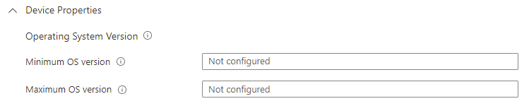
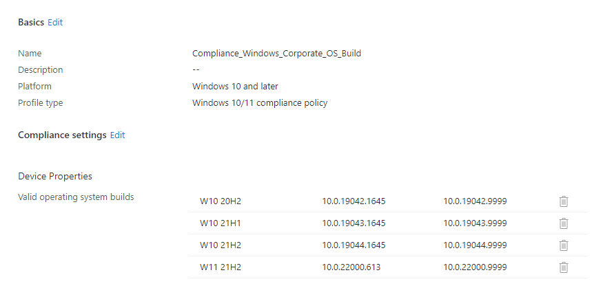
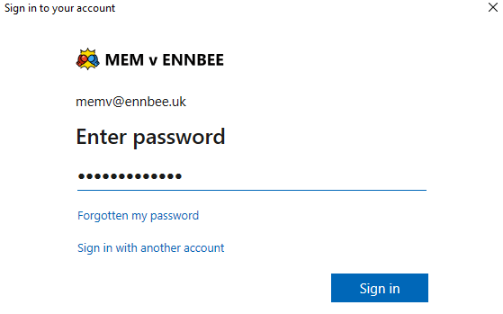
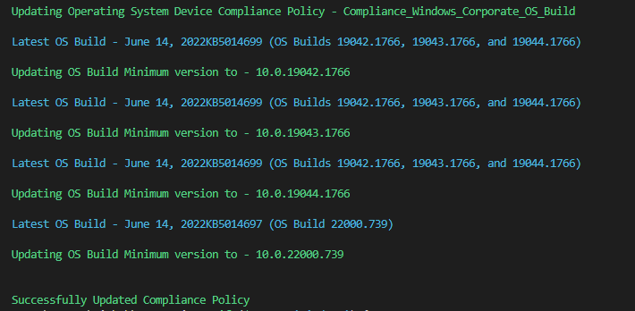
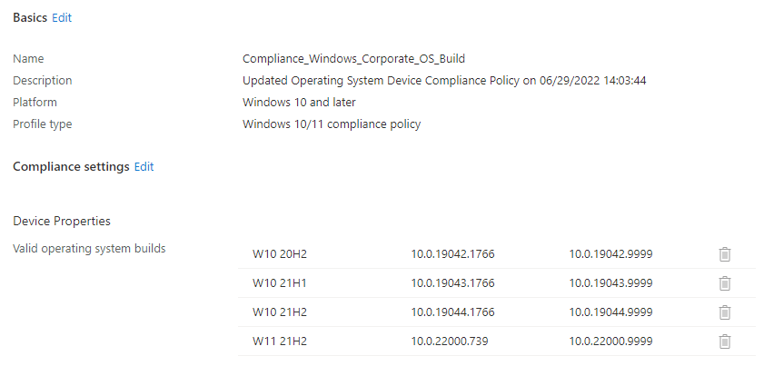

# Windows Operating System Compliance Updates


Let's talk about Windows 10 and above [Operating System Compliance](https://docs.microsoft.com/en-us/mem/intune/protect/compliance-policy-create-windows#operating-system-version) in Microsoft Intune, and specifically how using 'Minimum OS Version' and 'Maximum OS Version' is dumb and you should definitely check yourself if you're using this in your environment.

## Compliance

If you're already using Microsoft Intune compliance policies, good for you, and extra points if you've integrated these with Conditional Access policies. However, are you using Compliance Policies in the correct way, or even a way that makes sense?

### Compliance Granularity

I'll talk about granularity of compliance settings, and the main reason to split out these Compliance settings into separate policies, is the actions for non-compliance; you see, you only get one set of these per policy.

So where you would want to mark a device as non-compliant immediately if there is no Antivirus installed, would you want it to be the same for the supported operating system builds? (Clue here, the answer is no).

This is a very real-world configuration, if you're controlling the deferral and deadline settings of Software Updates via Windows Update for Business, it wouldn't be fair and honourable for you to mark a device as non-compliant, and potentially block access to Office 365 authenticated services, when the computer itself hasn't even received the update to be installed.

### Operating System Compliance

So now we know we should be using separate policies per compliance setting, so let's look at Operating System Versions:



With this setting you can configure the minimum and maximum operating system version, including build version using the below information to denote the format.


The operating system version is defined as **major.minor.build.revision**


Sounds great, **if and only if** all of your Windows 10 devices are all running the same Feature Update.

### The Problem

Let's say your estate has the following supported (at time of writing) Windows 10 and later versions:

- Windows 10 20H2
- Windows 10 21H1
- Windows 10 21H2
- Windows 11 21H2

So to cover all of the supported operating systems your minimum operating system compliance setting is going to be **10.0.19042.1766** (June 2022). Great.

This however means that any of the newer builds, patched or unpatched, will also be marked as compliant, as you know **10.0.19044.1111** is a bigger number than **10.0.19042.1766**. Quick Maths.

This is a problem, as do you really want to mark unpatched operating systems as compliant. Again, answer here is no.

### The Solution

This is where the 'Valid operating system builds' section in the Compliance Policy comes into play, allowing you to split out each build in your End-user computing estate and each to have their own range of minimum and maximum:



So there we have it, a fast turnaround for a real-world problem. Now about updating this monthly...

## Updating Compliance

When you update a Compliance Policy, it will trigger the devices the policy is assigned to, to re-evaluate the conditions and follow the actions for non-compliance if necessary. So you **should** be updating the Operating System Compliance Policy every month, which, although it isn't a painful task, it is a repeatable one.

### Needless Automation to the Rescue

So what does any good Consultant do in this situation? They write some PowerShell to do the work for them, even if writing the PowerShell script probably took longer than just updating the Compliance Policy.

I've already demonstrated my coffee fuelled scripting in  and this one isn't going to be much different.

### Functions are your Friends

We'll need a few functions for this, some grabbed from the [Intune PowerShell Samples](https://github.com/microsoftgraph/powershell-intune-samples) GitHub repo, and some thrown together based on the samples.

We'll be authenticating to Graph, grabbing the Windows Compliance Policies that have the Valid Operating System Build setting, getting the latest OS Build version from the [Microsoft Atom Feeds](https://support.microsoft.com/en-us/rss-feed-picker) and then updating the Compliance Policy. *This sounded easier in my head if I'm honest.*

### Authentication

~~The move to MSAL based authentication can be found in this post.~~


Connect to Graph using the latest module and `Connect-MgGraph -Scopes 'DeviceManagementManagedDevices.ReadWrite.All,DeviceManagementConfiguration.ReadWrite.All'`.


### Testing JSON

As we need to make sure the JSON we're generating is valid, best we test it before launching it at Graph.

```PowerShell
Function Test-JSON() {
    param (
        $JSON
    )
    try {
        $TestJSON = ConvertFrom-Json $JSON -ErrorAction Stop
        $validJson = $true
    }
    catch {
        $validJson = $false
        $_.Exception
    }

    if (!$validJson) {
        Write-Host "Provided JSON isn't in valid JSON format" -f Red
        break
    }
}
```

### Getting Compliance Policies

As we're going to be updating Compliance Policies, we should probably have a method to actually retrieve them using [GET /deviceManagement/deviceCompliancePolicies](https://learn.microsoft.com/en-us/graph/api/intune-deviceconfig-devicecompliancepolicy-list?view=graph-rest-1.0).

```PowerShell
Function Get-DeviceCompliancePolicy() {

    $graphApiVersion = "Beta"
    $Resource = "deviceManagement/deviceCompliancePolicies"

    try {
        $uri = "https://graph.microsoft.com/$graphApiVersion/$($Resource)"
            (Invoke-MgGraphRequest -Uri $uri-Method Get).Value
    }
    catch {
        Write-Error $Error[0].ErrorDetails.Message
        break
    }
}
```

### Updating Compliance Policies

This one I had to actually sort out myself, this function allows you to push updates to existing Compliance Policies. Details on this method can be found in the Graph API documentation [PATCH /deviceManagement/deviceCompliancePolicies/{deviceCompliancePolicyId}](https://docs.microsoft.com/en-us/graph/api/intune-deviceconfig-windows10compliancepolicy-update?view=graph-rest-beta) documentation.

```PowerShell
Function Update-DeviceCompliancePolicy() {

    [cmdletbinding()]
    param
    (
        $Id,
        $JSON
    )

    $graphApiVersion = "Beta"
    $Resource = "deviceManagement/deviceCompliancePolicies/$id"

    try {
        if (!$Id) {
            write-host "No Compliance Policy Id specified, specify a valid Compliance Policy Id" -f Red
            break
        }

        if ($JSON -eq "" -or $null -eq $JSON) {
            write-host "No JSON specified, please specify valid JSON for the Compliance Policy..." -f Red
        }
        else {
            Test-JSON -JSON $JSON
            $uri = "https://graph.microsoft.com/$graphApiVersion/$($Resource)"
            Invoke-MgGraphRequest -Uri $uri-Method Patch -Body $JSON -ContentType "application/json"
            Write-Host
            Write-Host "Successfully Updated Compliance Policy" -ForegroundColor Green
        }
    }
    catch {
        Write-Error $Error[0].ErrorDetails.Message
        break
    }
}
```

### Getting Latest Windows Version

This is where I had a lot of issues, mainly down to the `[xml]` setting when parsing the RSS feed, this is down to how the content is processed when handling it live, instead of outputting it to file.

Essentially, this function scrapes the Microsoft Atom Feed for Windows 10 and Windows 11 updates, dumps the versions into an array and picks out the most recent build version, avoiding 'Preview' and 'Out of band' updates.

```PowerShell
Function Get-LatestWindowsUpdatesBuild() {

    [cmdletbinding()]
    param
    (
        [ValidateSet('10', '11')]
        $OS,
        $Build
    )

    try {
        if (!$OS) {
            write-host "No OS specified, specify a valid Operating System number" -f Red
            break
        }
        else {
            if ($OS -eq '10') {
                $uri = "https://support.microsoft.com/en-us/feed/atom/6ae59d69-36fc-8e4d-23dd-631d98bf74a9"
            }
            elseif ($OS -eq '11') {
                $uri = "https://support.microsoft.com/en-us/feed/atom/4ec863cc-2ecd-e187-6cb3-b50c6545db92"
            }

            [xml]$Updates = (Invoke-WebRequest -Uri $uri -UseBasicParsing -ContentType "application/xml").Content -replace "[^\x09\x0A\x0D\x20-\xD7FF\xE000-\xFFFD\x10000-x10FFFF]", ""

            $BuildVersions = @()

            foreach ($Update in $Updates.feed.entry) {
                if (($update.title.'#text' -like "*$Build*") -and ($update.title.'#text' -notlike "*Preview*") -and ($update.title.'#text' -notlike "*Out-of-band*")) {
                    $BuildVersions += $update.title.'#text'
                }
            }
            write-host
            write-host "Latest OS Build - $($BuildVersions[0])" -ForegroundColor Cyan
            $BuildVersions[0].Substring($BuildVersions[0].LastIndexOf(".")) -replace "[')', '.']", ""
        }
    }
    catch {
        Write-Error $Error[0].ErrorDetails.Message
        break
    }
}
```

## Getting, Setting and Updating

Finally we get to utilising the functions, putting it all together and updating the Compliance Policy with the latest minimum OS build version based on the latest release of each Windows 10 and later build.

Let's break down each section before I launch the full script at you.

### Getting the Correct Policy

We need to make sure we're pulling through only Windows based Compliance Policies, and only those that have legitimate build version information. We're using the `@odata.type` and the `validOperatingSystemBuildRanges` data here.

```PowerShell
$OSCompliancePolicies = Get-DeviceCompliancePolicy | Where-Object { ($_.'@odata.type').contains("windows10CompliancePolicy") -and ($_.validOperatingSystemBuildRanges) -ne "" }
```

### Getting the Build Versions

To update each field in the Compliance Policy, we need to handle each line, in this example we only have the four currently supported versions of Windows 10, but we need the script to cater for all versions. Using this we can get the latest build version for each Windows version.

```PowerShell
$OSBuilds = $OSCompliancePolicy.validOperatingSystemBuildRanges
$OSUpdates = @()
    foreach ($OSBuild in $OSBuilds) {
        if ($OSBuild.lowestVersion -like '*10.0.1*') {
            $WindowsVersion = '10'
        }
        elseif ($OSbuild.lowestVersion -like '*10.0.2*') {
            $WindowsVersion = '11'
        }

    $OSVersion = $OSBuild.lowestVersion.Split('.')[2]
    $BuildVersion = Get-LatestWindowsUpdatesBuild -OS $WindowsVersion -Build $OSVersion
    $NewOSBuildVersion = '10.0.' + $OSVersion + '.' + $BuildVersion
    }
```

### Building the JSON Payload

Now that we have the required information, we need to build the JSON payload to update the Compliance Policy with, based on the existing data and the new minimum OS build versions.

```PowerShell
$Update = New-Object -TypeName psobject
$Update | Add-Member -MemberType NoteProperty -Name '@odata.type' -Value '#microsoft.graph.windows10CompliancePolicy'
$Update | Add-Member -MemberType NoteProperty -Name 'description' -Value $Description

foreach ($OSBuild in $OSBuilds) {
    $OSUpdate = New-Object -TypeName psobject
    $OSUpdate | Add-Member -MemberType NoteProperty -Name 'description' -Value $OSBuild.description
    $OSUpdate | Add-Member -MemberType NoteProperty -Name 'lowestVersion' -Value $NewOSBuildVersion
    $OSUpdate | Add-Member -MemberType NoteProperty -Name 'highestVersion' -Value $OSBuild.highestVersion
    $OSUpdates += $OSUpdate
    }

$Update | Add-Member -MemberType NoteProperty -Name 'validOperatingSystemBuildRanges' -Value @($OSUpdates)
$JSON = $Update | ConvertTo-Json -Depth 3
```

### Fusion, Ha

Seeing the whole bunch of bits together looks a little bit like this, and the [full script](https://github.com/ennnbeee/oddsandendpoints-scripts/blob/main/Intune/Compliance/WindowsOSCompliance/Set-WindowsOSCompliance.ps1) can be found in my GitHub repo.

```PowerShell
$Date = Get-Date
$Description = "Updated Operating System Device Compliance Policy on $Date"

$Update = New-Object -TypeName psobject
$Update | Add-Member -MemberType NoteProperty -Name '@odata.type' -Value '#microsoft.graph.windows10CompliancePolicy'
$Update | Add-Member -MemberType NoteProperty -Name 'description' -Value $Description

$OSCompliancePolicies = Get-DeviceCompliancePolicy | Where-Object { ($_.'@odata.type').contains("windows10CompliancePolicy") -and ($_.validOperatingSystemBuildRanges) -ne "" }
foreach ($OSCompliancePolicy in $OSCompliancePolicies) {
    Write-Host
    Write-Host "Updating Operating System Device Compliance Policy - $($OSCompliancePolicy.displayname)" -ForegroundColor Green
    $OSBuilds = $OSCompliancePolicy.validOperatingSystemBuildRanges
    $OSUpdates = @()

    foreach ($OSBuild in $OSBuilds) {
        if ($OSBuild.lowestVersion -like '*10.0.1*') {
            $WindowsVersion = '10'
        }
        elseif ($OSbuild.lowestVersion -like '*10.0.2*') {
            $WindowsVersion = '11'
        }

        $OSVersion = $OSBuild.lowestVersion.Split('.')[2]
        $BuildVersion = Get-LatestWindowsUpdatesBuild -OS $WindowsVersion -Build $OSVersion
        $NewOSBuildVersion = '10.0.' + $OSVersion + '.' + $BuildVersion
        Write-Host
        Write-Host "Updating OS Build Minimum version to - $NewOSBuildVersion" -ForegroundColor Green

        $OSUpdate = New-Object -TypeName psobject
        $OSUpdate | Add-Member -MemberType NoteProperty -Name 'description' -Value $OSBuild.description
        $OSUpdate | Add-Member -MemberType NoteProperty -Name 'lowestVersion' -Value $NewOSBuildVersion
        $OSUpdate | Add-Member -MemberType NoteProperty -Name 'highestVersion' -Value $OSBuild.highestVersion
        $OSUpdates += $OSUpdate

    }

    # Creating JSON object to pass to Graph
    $Update | Add-Member -MemberType NoteProperty -Name 'validOperatingSystemBuildRanges' -Value @($OSUpdates)
    $JSON = $Update | ConvertTo-Json -Depth 3

    # Updating the compliance policy
    Update-DeviceCompliancePolicy -Id $OSCompliancePolicy.id -JSON $JSON
}
```

## The Action Shot

Time to finally run this script and add some level of automation to this laborious task of updating Compliance Policy...

```PowerShell
.\Set-WindowsOSCompliance.ps1
```

Running the script will prompt you to provide a username and connect to Graph, please do this and login:



Then it does everything for you, and tells you about it:



Best we check the Compliance Policy to make sure it's done what I asked it to:



It did, and a cheeky description based on when the policy was last updated.

## Summary

This one was a bit long winded, but it does give you an insight in not only why granular compliance policies are important, but also how to work around limitations within them. The limitations, especially when your organisation is adhering to security frameworks and *need* specific operating system compliance are something you may have to battle with, or in this instance, just take my example and run.

Luckily other Operating System compliance such as Android or iOS/iPadOS isn't as complicated to handle, but I might do a write up on that at some point...maybe a rainy day.

Also, if you have the inclination, you could expand upon this script and have it run on a schedule, but you'll have to change the authentication method and associated permissions utilising an App Registration in Azure AD...sounds thrilling.

