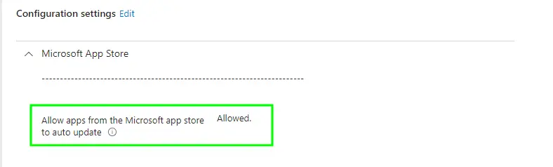
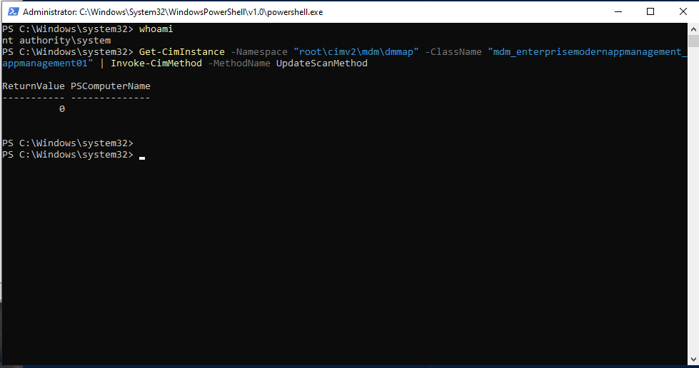
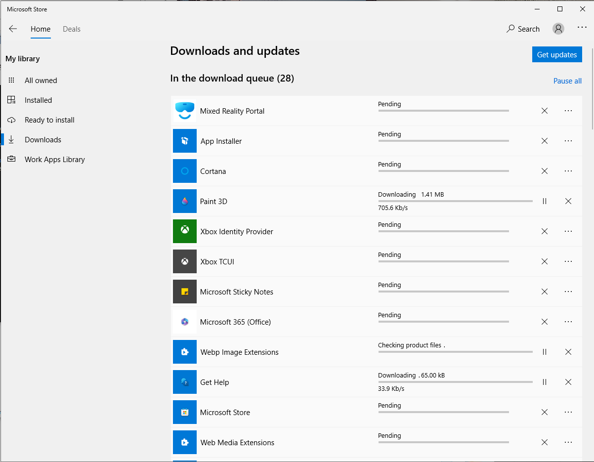
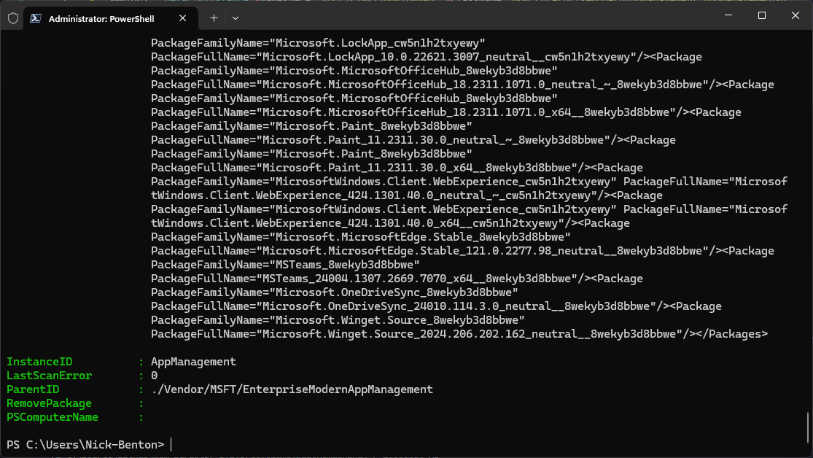
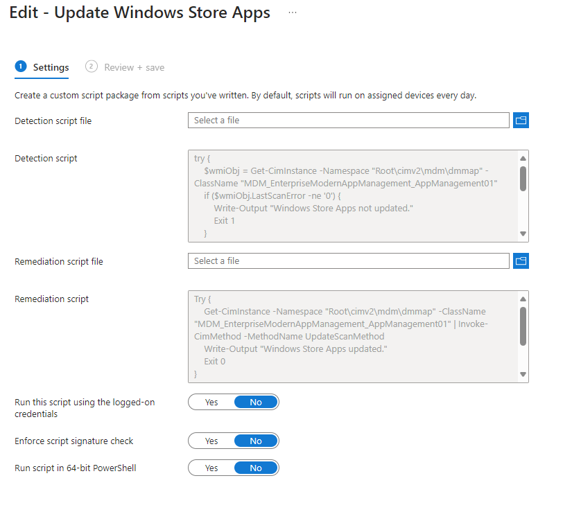
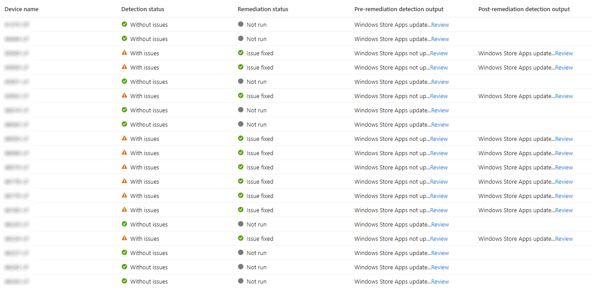

# Keeping Windows Store Apps Updated with Microsoft Intune


So we're all onboard with the [New Microsoft Store](https://learn.microsoft.com/en-us/mem/intune/apps/store-apps-microsoft), and deploying both UWP and Win32 apps from Microsoft Intune is an absolute breeze, and reduces the effort of deploying applications to a click click next OK exercise. What about the UWP apps that are already installed on a Windows Autopilot device, shouldn't we give them a bit of love? If you care at all about users and security you should.

<!--more-->

## Allowing App Updates

Regardless of how you are blocking or allowing the Microsoft Store, remembering that the store needs to be [available](https://learn.microsoft.com/en-us/mem/intune/apps/store-apps-microsoft#prerequisites) to allow for apps from Microsoft Intune to be deployed, we should at least configure devices to allow for updates.

A simple [Settings Catalog](https://learn.microsoft.com/en-us/mem/intune/configuration/settings-catalog) profile will do the job here, with the below settings configured.

| Category | Setting | Value |
| :- | :- | :- |
| Microsoft App Store | Allow apps from the Microsoft app store to auto update | `Allowed` |



Assign this profile to your devices, all of them obviously, no testing needed here.

## Forcing App Updates

There's a lot of chatter about how to force store apps to update, but essentially we can kick off an update using the below **Get-CimInstance** query.

```PowerShell
Get-CimInstance -Namespace "Root\cimv2\mdm\dmmap" -ClassName "MDM_EnterpriseModernAppManagement_AppManagement01" | Invoke-CimMethod -MethodName UpdateScanMethod
```

Now as we're calling areas that require elevation, standard users are bang out of luck from running this, and even running this elevated as Administrator does absolutely nothing for the apps themselves, something about install context.

So what are our options? Well for testing it's [PsExec](https://learn.microsoft.com/en-us/sysinternals/downloads/psexec).

Running the above from PowerShell running as system using `PsExec.exe -s -i powershell.exe`, we can kick off the app update query.



Nothing much to look at here, but if you've got the store open, you should now see updates in the Downloads and Updates section, if you're lazy run `start ms-windows-store://downloadsandupdates` as a standard user to open the correct area of the store.



Brilliant, apps are now trying their hardest to update. Now we've got a method to update the apps, no one is going to run this manually on a regular basis, and we love a [Microsoft Intune Remediation](https://learn.microsoft.com/en-us/mem/intune/fundamentals/remediations).


This method will only update Store Apps installed in the **System** context if there is no user signed into the device; for Apps installed in the **User** context, a user must be signed in for the apps to update. Go figure 😅.


## Remediation Settings

So now we've got a way to start the update of the apps, let's find a way to work out if we need to kick off an update. Back to the initial query we created, and if we run the below section of the command, we'll get an output that we might be able to work with.

```PowerShell
Get-CimInstance -Namespace "Root\cimv2\mdm\dmmap" -ClassName "MDM_EnterpriseModernAppManagement_AppManagement01"
```



Guess what, we do, that **LastScanError** is looking mighty interesting, and it being Microsoft I bet that an exit code of zero means success, but we should have a look at the [reference document](https://learn.microsoft.com/en-us/windows/client-management/mdm/enterprisemodernappmanagement-csp#deviceappmanagementlastscanerror) just in case.

> Reports the last error code returned by the update scan.
>
> This is a required node.

OK, so it isn't that clear, but we've got a way to detect whether the last update of apps was successful, and with the Settings Catalog policy created earlier we should be keeping apps up to date from then on.

### Detection Script

We can use the above, and a little logic to detect whether the result of the **LastScanError** is a zero or not, and if it's not a zero throw an **Exit 1** to allow a remediation to run.



On to the remediation portion.

### Remediation Script

We've already done the ground work with the previous queries to test the update of apps, so this one is very straightforward.



Just make sure we're exiting with the correct codes, and giving an explanation, as per the detection script, of the result of the remediation.

## Deploying the Remediation

We've seen remediations a  of times now in this blog, so go ahead and create a new Remediation Script in Microsoft Intune mirroring the below settings. Be aware that we definitely do not want to be running this as the user, we *need* that glorious system context.



I've assigned this to **All Devices** with my beloved [Device Filters](https://learn.microsoft.com/en-us/mem/intune/fundamentals/filters) on a daily schedule, but if you're more cautious than I am, assign this to a smaller proof-of-concept group.

After a while, you should start seeing the results of the Remediation, and hopefully positive ones to boot.



If all goes well, your devices will start actually updating the 'Built In' apps you haven't ripped out with a PowerShell script, and Microsoft Intune UWP store apps you've deployed, though your users may start complaining about the apps looking like they're loading in the Start Menu 😂.

## Summary

All in all a quick and dirty solution to a very simple problem with new Windows Autopilot devices and existing Microsoft Intune managed Windows devices, at least this way they'll do what they should have done in the first place and just keep themselves updated.

If only all the issues I encounter during my days could be solved with a simple Remediation script.


The detection and remediation scripts are available, as always in my [Github Repo](https://github.com/ennnbeee/oddsandendpoints-scripts/blob/main/Intune/Remediation/UpdateStoreApps).


