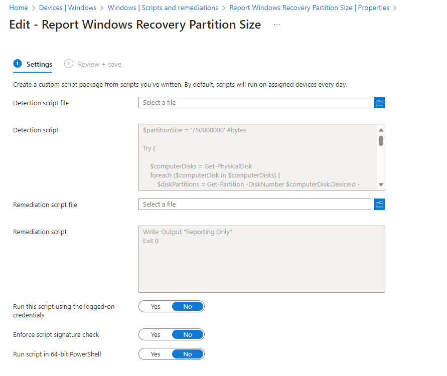
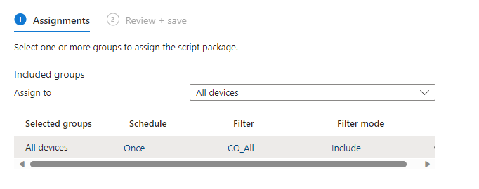
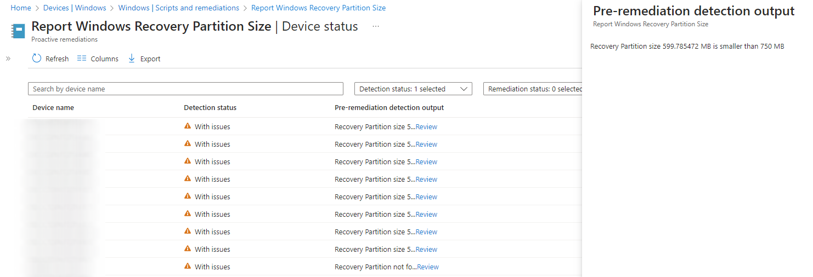
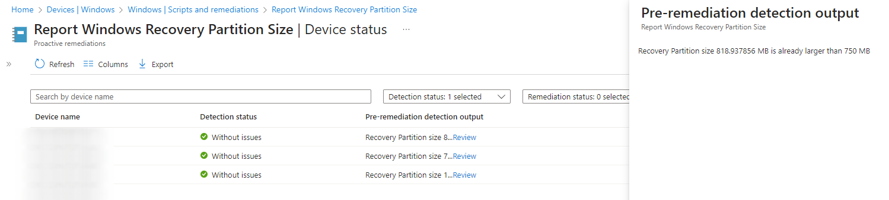
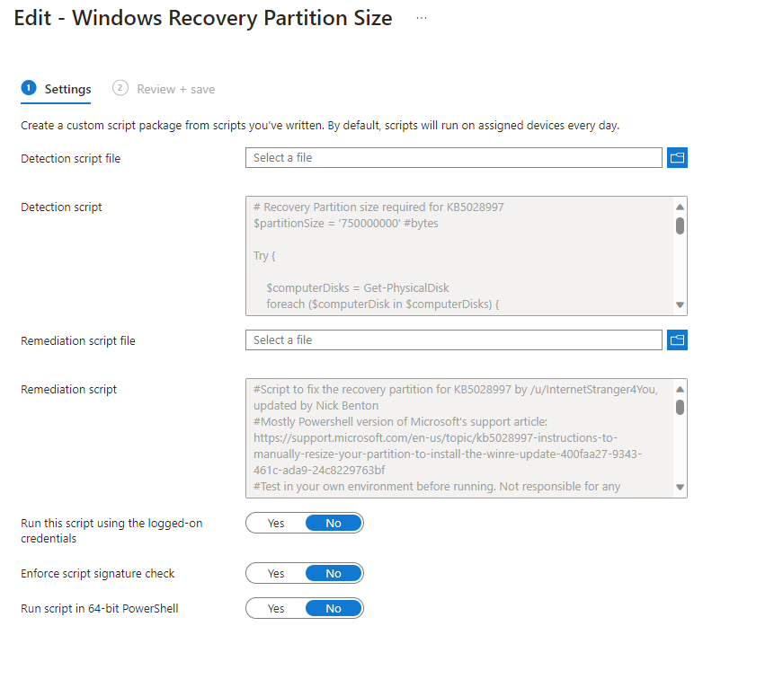
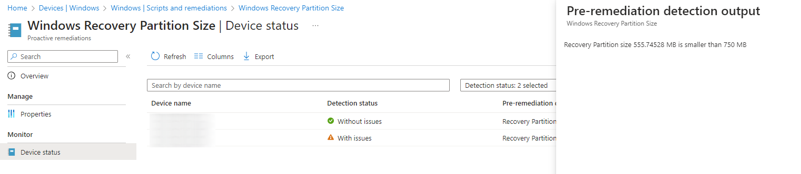
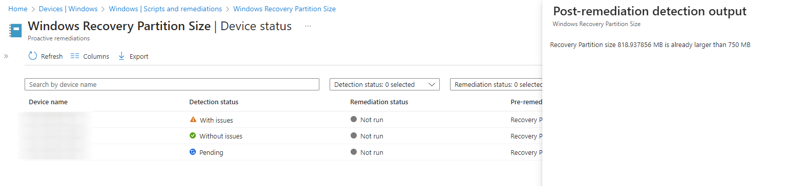

# Automatically Resizing the WinRE Partition for Windows Update KB5034441

If you've been under a rock, or like me, don't have to manage updates on a Windows device estate any more, chances are you might not have seen the issues with the size of the [Windows Recovery Environment](https://support.microsoft.com/en-us/windows/create-a-recovery-drive-abb4691b-5324-6d4a-8766-73fab304c246) or WinRE, partition when applying Windows Updates like [KB5034441](https://support.microsoft.com/en-au/topic/kb5034441-windows-recovery-environment-update-for-windows-10-version-21h2-and-22h2-january-9-2024-62c04204-aaa5-4fee-a02a-2fdea17075a8), luckily Microsoft released a 'fix' for this in [KB5028997](https://support.microsoft.com/en-us/topic/kb5028997-instructions-to-manually-resize-your-partition-to-install-the-winre-update-400faa27-9343-461c-ada9-24c8229763bf) to resize the partition to allow for updates to install.

Now if this were me, I'd be looking for a way to push out this fix to the impacted devices, and thanks to [u/InternetStranger4You](https://www.reddit.com/user/InternetStranger4You/), they created a PowerShell script to do [just that](https://www.reddit.com/r/sysadmin/comments/19dyiuz/script_to_fix_kb5028997/), so all credit goes their way.

So why I am writing this? Well, let's find a way to use [Microsoft Intune Remediations](https://learn.microsoft.com/en-us/mem/intune/fundamentals/remediations), to detect and fix devices that are falling short of the partition size requirement.

## Detection Methods

To get ourselves in a good position, we should look at a way to detect that the existing Windows Recovery Environment partition is of a suitable size, from this we can either leave it well alone, or hack at it to increase it's size, once, and only once.

### First We Detect

Working with the remediation format and capture of information, we can quite simply loop through all physical disks with `Get-PhysicalDisk`, detecting where one of these disks contains partitions with a 'C' drive (Yes I am assuming here that the disk holding the C drive is holding the Recovery Partition, prove me wrong though), using `Get-Partition`, ~~and then comparing the size of the disk to our variable in bytes, `$partitionSize`.~~ and then get the amount of free space available in the volume with `Get-Volume`, comparing this to our variable for required space `$freePartitionSpace`.


The detection method has been updated to detect free space in the Recovery Partition, instead of blindly increasing it by 250MB.




If the result of the comparison is that the ~~size of the partition is smaller than the 750MB configured in `$partitionSize`~~ free space of the partition is smaller than the 250MB configured in `$freePartitionSpace`, then we'll report the status with `Write-Output` and `Exit 1`, otherwise, all is OK so we `Exit 0` still reporting something.

### Then We Report

So, we should see how many devices are effected by a small partition size, so for fun, we can push out **just** the [detection script](https://github.com/ennnbeee/oddsandendpoints-scripts/blob/main/Intune/Remediation/WinREPartition/Set-WinRE_Detection.ps1) using a Remediation, but with a non-functioning [remediation script](https://github.com/ennnbeee/oddsandendpoints-scripts/blob/main/Intune/Remediation/WinREPartition/Set-WinRE_ReportRemediation.ps1).



This will at least give you some idea of the devices that would be impacted by the true remediation script.

I've assigned this to the **All Devices** group, but with a Device Filter for only corporate owned devices, set to run once, as we're just reporting on this issue for now.

After waiting a little while, or if you're impatient use the [on-demand feature](https://learn.microsoft.com/en-us/mem/intune/fundamentals/remediations#run-a-remediation-script-on-demand-preview), we can then review the results; we can see several devices that are now complaining that their WinRE partition is too small.

Luckily for us, there are at least some devices where they are happy with the size of their partition.

## Remediation Methods

As we have a good understanding following the implementation of the report only style Remediation, we can now investigate how best to actually fix the issue. For this, we can take the existing script by [u/InternetStranger4You](https://www.reddit.com/user/InternetStranger4You/) and modifying it to support the required exit codes for Microsoft Intune.

### Script Breakdown

The script itself is taking the manual steps detailed by Microsoft in [KB5028997](https://support.microsoft.com/en-us/topic/kb5028997-instructions-to-manually-resize-your-partition-to-install-the-winre-update-400faa27-9343-461c-ada9-24c8229763bf), and wrapping them nicely in PowerShell, but I'll walk through the settings so we're all on the same page:

- Ensures that the script can read the contents of the `reagentc.exe` command by capture the output of the process using `New-Object System.Diagnostics.ProcessStartInfo` as the output data is used throughout the script.
- Checks if there is anything wrong with WinRE with `if (($stdout.IndexOf('harddisk') -ne -1) -and ($stdout.IndexOf('partition') -ne -1))`, and if so exits.
- Disables the recovery environment `Start-Process 'reagentc.exe' -ArgumentList '/disable' -Wait -NoNewWindow` to allow for modification to the partition.
- Captures information about the Disk the Recovery partition sits on, and the partition itself.
- Resizes the partition beneath the Recovery partition by 250MB `Get-Disk $diskNum | Resize-Partition -PartitionNumber ($recPartNum - 1) -Size ($size - 250MB)`
- Removes the existing Recovery partition aggressively `Get-Disk $diskNum | Remove-Partition -PartitionNumber $recPartNum -Confirm:$false`
- Passes the required arguments for `DiskPart` to a text file 'ResizeREScript.txt' located in `$env:TEMP` that can be called on later that:
  - Creates a new partition on the disk based on whether the partition style is GPO or MBR
  - Applies the correct attributes to the new partition to configure it as a Recovery partition
  - Formats the partition in NTFS format
- Finally enabling the recovery agent with `Start-Process 'reagentc.exe' -ArgumentList '/enable' -Wait -NoNewWindow` to allow for the failing update to be installed.

All of these settings are exactly as per the Microsoft provided document, but you know, done for you.

### Now We Attack

To allow the script to work within a Remediation, we need to ensure that the data being passed back to Microsoft Intune is suitable, and other that wrapping the bulk of the script in some `Try` and `Catch` logic, and handling the output of the commands with `Write-Output` and corresponding `Exit` codes, there isn't a whole heap for us to do thankfully.



With the script now in a more useful format, on to how we deploy this to a select group of test devices.

## Deploying the Remediation

I would strongly advised testing this in small numbers before you go deploying the the `All Devices` group, and use a new Remediation with the same [detection script](https://github.com/ennnbeee/oddsandendpoints-scripts/blob/main/Intune/Remediation/WinREPartition/Set-WinRE_Detection.ps1) method as before, but this time with the fully functioning [remediation script](https://github.com/ennnbeee/oddsandendpoints-scripts/blob/main/Intune/Remediation/WinREPartition/Set-WinRE_Remediation.ps1), so we can actually fix this issue that Microsoft has caused.

The Remediation should look something like the below, again with a schedule for once as we don't need this running more than once.

If we've been successful in our deployment we should start seeing device report back the status of the remediation, and advise where there are issues with the size of the WinRE partition.

Following the successful run of the remediation script, we now have an output of the results with a device that had issues with the partition size, now successfully remediated.

All is left to do now, is find some more test devices to add to the assignment group, and monitor their progress.

## Summary

In short, this should allow you to get over the hurdle caused by the failing update delivery, and also give the devices with the issue a push in the right direction following the update to their recovery partition size, to allow them to realise they can now install the update. I can't take credit for the scripting of the Microsoft published resolution, that goes to [u/InternetStranger4You](https://www.reddit.com/user/InternetStranger4You/), but with this and moving it to a Remediation in Microsoft Intune, means that it can do the heavy lifting on your behalf.

Or you can just wait for Microsoft to release a fix, totally up to you.

Thanks to [piotrxj](https://github.com/piotrxj) in the comments for the updated detection method.


I hold no responsibility for the impact to your devices or environments, please, please, please test this on devices you do not care about first before even contemplating pushing this to a wider audience.


